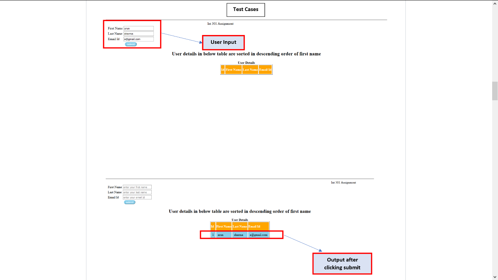

# INT301 Assignment
User will enter first name, last name, email id on a form these values are inserted to database. Data from database is displayed in descending order of first name. it dynamically sorts data when new values are inserted into database they are added to output and sorted in descending order
# Test case

